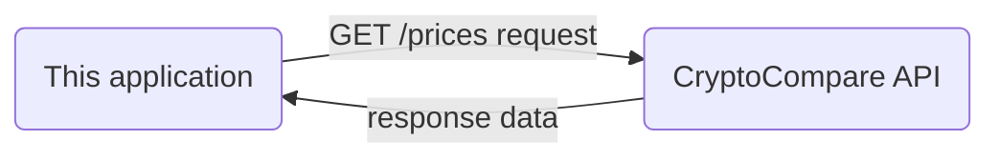

# cyptocli - Crypto Portfolio Checker
**cryptocli** - is a cryptocurrency (token) portfolio checker where a user can query portfolio by token or date.
# Table of Content
1. [Installation & Setup](#installation-and-setup)
2. [Getting Started](#getting-started)
3. [File Structure](#file-structure)
4. [Code Standards](#code-standards)
5. [API Documentation](#api-documentation)
6. [Performance](#performance)
# Installation and Setup
## Requirements
### 1. Node.js Environment
*node.js* runtime environment is required to run the application. Please ensure you've ***>=node.js v14*** installed. Download & Install node.js [here](https://nodejs.org/en/)

To check the version of installed node.js,  please enter the following command
```
$ node --version
```
### 2. Git (Version Control)
git is required to push / pull content between remote and local. Download & Install git [here](https://git-scm.com/)

To check the version of installed git,  please enter the following command
```
$ git --version
```
## Environment Variables

To get real-time cryptocurrency exchange rates, the application depends on **[CryptoCompare](https://min-api.cryptocompare.com/)** API. The following environment variables are required to be set before running the application -
```
API_KEY={your_api_key}
API_BASE_URL=https://min-api.cryptocompare.com/data
```
## Install Dependencies
This project uses **npm** to manage dependencies. Please run the following command to install the dependencies
```
$ npm install
```
## Development Build
To start the application in development build mode, please run the following command
```
$ npm run dev
```
## Production Build
To build the production build, enter the following command
```
$ npm build
```
To create a production build and start the application, please enter the following command

```
$ npm start
```
## Tests
This project uses [**jest**](https://jestjs.io/) as an assertion library for unit testing. To run tests, please enter the following command
```
$ npm test
```
To run the tests in watch mode, enter the following command
```
$ npm run test:watch
```
# Getting Started
Using this application is pretty easy. It accepts **two** optional arguments:
|Argument|Required|Description|Example
|-|-|-|-|
|token|no| portfolio value filtered by the given token. Returns all tokens if not provided|"BTC" / "XRP" / "ETH"
|date|no|portfolio value on the specified date (YYYY-MM-DD). Returns latest values if not provided|"2019-09-19"

# File Structure
This project follows the following structure ---
```
├── build
├── coverage
├── node_modules
├── src
│   ├── data
│   │   ├── transactions.csv
│   ├── interfaces
│   │   ├── PortfolioValues.ts
│   │   ├── Transaction.ts
│   ├── services
│   │   ├── ExchangeRateService.ts
│   │   ├── PortfolioService.ts
│   ├── index.ts
│   ├── loader.ts
│   ├── utils.ts
├── tests
│   ├── data
│   │   ├── test1.csv
│   │   ├── test2.csv
│   ├── services
│   │   ├── ExchangeRateService.test.ts
│   │   ├── PortfolioService.test.ts
├── .env
├── .gitignore
├── jest.config.js
├── .gitignore
├── package-lock.json 
├── package.json
├── README.md
└── tsconfig.json
```

# Code Standards
## TypeScript
Use typescript, with a combination of Interfaces and Classes to specify types whenever possible. **Try not to `any`** type unless its obvious. Never use `never` type annotations.
## Indentation
Use `4 space` indentation.
## File Names
For class file name, use the `PascalCase` convention, otherwise use `snake_case`.
## Naming Convention
For variables and function names, use `camelCase`. For class/interface names, use `PascalCase`.

Please read a comprehensive guideline here --- [JavaScript Coding Guidelines](https://gist.github.com/antonrogov/1216380/21800f463af3d3a98e98083c4bc109e44f981ef4)
# API Documentation
## Interfaces
### 1. PortfolioValues
```
PortfolioValues {
	ETH: number;
	BTC: number;
	XRP: number;
	temp?: any;
}
```
### 2. Transaction
```
Transaction {
	timestamp: string;
	transaction_type: string;
	token: string;
	amount: number;
}
```
## Service Classes
### 1. PortfolioService
### `getPortfolio(filepath: string, token?: string, date?: string): void`
*Driver function to get portfolio values*
|Params|Required|Description|Example
|-|-|-|-|
|filepath|yes|a path that resolves to the targeted CSV file|"src/data/transactions.csv"
|token|no| portfolio value filtered by the given token. Returns all tokens if not provided|"BTC" / "XRP" / "ETH"
|date|no|portfolio value on the specified date (YYYY-MM-DD). Returns latest values if not provided|"2019-09-19"
Returns --- nothing `(void)`
### `updatePortfolioBy(transaction: Transaction, token?: string, date?: string): void`
*Gets called every time with a new row, updates portfolio values*
|Params|Required|Description|Example
|-|-|-|-|
|transaction|yes|the single row transaction data|`{timestamp: 16557476756, transaction_type: DEPOSIT, token: BTC, amount: 0.534646}`
|token|no| portfolio value filtered by the given token. Returns all tokens if not provided|"BTC" / "XRP" / "ETH"
|date|no|portfolio value on the specified date (YYYY-MM-DD). Returns latest values if not provided|"2019-09-19"
Returns --- nothing `(void)`
### `calculateEachTransaction(transaction: Transaction): void`
*Calculates total by processing each transaction*
|Params|Required|Description|Example
|-|-|-|-|
|transaction|yes|the single row transaction data|`{timestamp: 16557476756, transaction_type: DEPOSIT, token: BTC, amount: 0.534646}`
Returns --- nothing `(void)`
### `calculateResult(): Promise<void>`
*Calculates final result after all the data read is completed*
|Params|Required|Description|Example
|-|-|-|-|
|n/a|n/a|n/a|n/a
Returns --- nothing `(void)`
### `printResult(): void`
*Prints final result in the command line*
|Params|Required|Description|Example
|-|-|-|-|
|n/a|n/a|n/a|n/a
Returns --- nothing `(void)`
### 2. ExchangeRateService
### `getExchangeRate(): Promise<any>`
*Get exchange rate from API*
|Params|Required|Description|Example
|-|-|-|-|
|n/a|n/a|n/a|n/a
Returns --- `any`
## Utility Functions
### `isAfter(date: string, timestamp: string): boolean`
*Checks whether the current row date (2nd parameter) is after chosen date (1st parameter)*
|Params|Required|Description|Example
|-|-|-|-|
|date|yes|the user input date|"2018-11-23"
|timestamp|yes|the transaction timestamp|"2019-10-03"
Returns --- `boolean`

# Performance
This application's performance vastly depends on the capability of the CSV parser. We've used [**papaparse**](https://www.npmjs.com/package/papaparse), a CSV parser with *fastMode* enabled. The performance comparison is made previously with multiple popular CSV parsers - [JavaScript CSV Parsers Comparison](https://leanylabs.com/blog/js-csv-parsers-benchmarks/). For a quick overview, here is a comparison in non-quoted CSV data:


In our test, to process a 30 million line CSV file, papaparse took around 15 to 17 seconds (which is incredibly fast).
